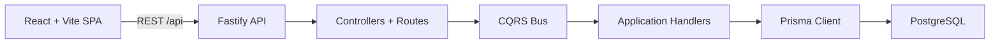

# PocketLedger

<div align="center">

**CQRS-ready personal finance monorepo built with React, Fastify, Prisma, and PostgreSQL.**

[](https://react.dev/)
[](https://vite.dev/)
[](https://fastify.dev/)
[](https://www.prisma.io/)
[](https://www.postgresql.org/)
[](https://www.typescriptlang.org/)
[](https://www.docker.com/)

[Overview](#overview) • [Architecture](#architecture) • [Workspace Map](#workspace-map) • [Quick Start](#quick-start) • [Docker Dev](#docker-dev)

</div>

## Overview

PocketLedger is a starter monorepo for an income and expense tracking product. The repo is split into a React SPA frontend, a Fastify REST API backend, an application layer for CQRS handlers, shared contracts, and a Prisma-backed PostgreSQL database layer.

The goal is simple: keep the first version easy to navigate while leaving a clean path for richer transaction flows, projections, reporting, and background jobs later.

## Highlights

- React 19 + Vite frontend with a dashboard-style shell
- Fastify 5 backend with a CQRS entrypoint
- Shared TypeScript contracts across layers
- Prisma 7 + PostgreSQL 16 for durable relational data
- Docker Compose development stack with health checks and watch mode
- Monorepo workspace layout that keeps boundaries explicit

## Architecture



## Workspace Map

| Workspace | Responsibility | Notes |
| --- | --- | --- |
| `frontend` | React SPA | Dashboard, transactions browser, and editor UI |
| `backend` | Fastify API | Routes, controllers, app bootstrap, and CQRS dispatch |
| `application` | CQRS handlers | Query and command handler implementations |
| `contracts` | Shared contracts | Request and response types shared across layers |
| `database` | Prisma + DB client | Prisma schema, migrations, generated client, and DB exports |
| `docker` | Container setup | Dockerfiles used by the local dev stack |

## Current Scope

- Implemented backend endpoints:
  - `GET /api/health`
  - `GET /api/users/me`
  - `GET /api/queries/users/me`
- Implemented database model:
  - `User`
- Frontend status:
  - Overview and transaction flows are currently mock-driven UI
  - Health-check plumbing exists for backend connectivity

## Project Structure

```text
PocketLedger/
  frontend/     React SPA
  backend/      Fastify API, controllers, CQRS contracts
  application/  CQRS command and query handlers
  contracts/    Shared request and response types
  database/     Prisma schema, migrations, generated client
  docker/       Dockerfiles for frontend and backend services
```

## Quick Start

1. Install dependencies.

   ```bash
   npm install
   ```

2. Copy the backend environment file.

   ```bash
   copy backend\.env.example backend\.env
   ```

3. Start PostgreSQL.

   ```bash
   docker compose up -d
   ```

4. Generate the Prisma client and apply migrations.

   ```bash
   npm run db:generate
   npm run db:migrate
   ```

5. Start frontend and backend.

   ```bash
   npm run dev
   ```

Local ports:

- Frontend: `http://localhost:5173`
- Backend: `http://localhost:3000`

## Docker Dev

For day-to-day development, Docker Compose watch mode is the intended workflow.

```bash
npm run dev:docker
```

Docker Desktop ports:

- Frontend: `http://localhost:4200`
- Backend: `http://localhost:4201`
- Prisma Studio: `http://localhost:4202`
- PostgreSQL: `localhost:5432`

Useful scripts:

- `npm run dev:docker`
- `npm run dev:docker:detached`
- `npm run dev:docker:down`
- `npm run dev:local`
- `npm run db:up`
- `npm run db:down`
- `npm run db:logs`
- `npm run db:studio:docker`

## Stack Choice

PostgreSQL is the right default here because financial data is relational, query-heavy, and benefits from strong constraints and decimal-safe storage.

- Frontend: React + Vite + TypeScript
- Backend: Fastify + TypeScript
- Database: PostgreSQL + Prisma

## Formatting

The repo uses root-level Prettier so the same formatter applies across TypeScript, JSON, Markdown, HTML, and SCSS.

- `npm run format`
- `npm run format:check`
